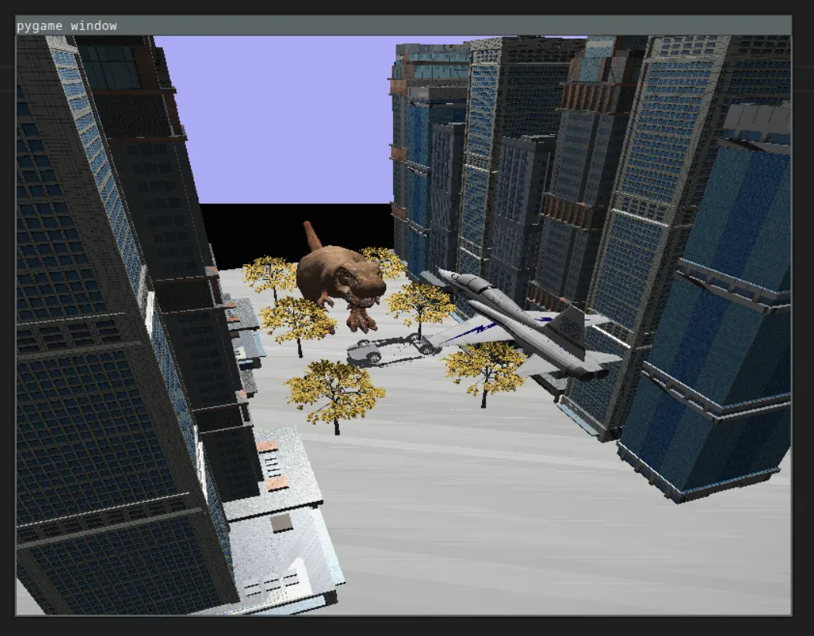

# opengl_pygame
Coursework for Computer Graphics module using [Pyghme](https://www.pygame.org/news) and [OpenGL](https://www.opengl.org/)

## project structure
This project is comprised of 3 main folders. The actual code for the project lies in the "engine_code" folder. The downloaded textures is where some textures for the models are. And lastly "coursework_spec" has the pdf's for the tasks and marking criteria. 

```
└── opengl_pygame/
    ├── --> engine_code 
    ├── downloaded_textures 
    └── coursework_spec_pdf 
```

## How to run the code? 
Within the "engine_code" folder run the command below. It will open pygame using the graphics engine of opengl to render a 3d scene.    
```
python3 ./ecm3423_ws8.py
```

## Youtube video of the rendering
Click on the link below to see a summary of how the code works and an example

[Youtube Link: Pygame OpenGL Rendering](https://www.youtube.com/watch?v=XTd0tisWBIA)

## Controls?
The classic scheme of 
1. WASD for movement
2. Mouse for looking around
3. '0' key to convert the objects to their wireframe
4. 'q' key to quit the rendering opengl window.

## Requirements:
Libraries requried are 
1. [Pyghme](https://www.pygame.org/news)
2. [OpenGL](https://www.opengl.org/)
3. [numpy](https://numpy.org/install/)

## Config
If you are having issues with loading the materials into the models it will be beacuse the folder structure on your specific machine is different to the one that I am running. Hence go through the folder structure below; and change the lines within the objects.mtl to the textures within the download textures folder in the root of the project.
```
opengl_pygame --> engine_code --> models --> 
```


